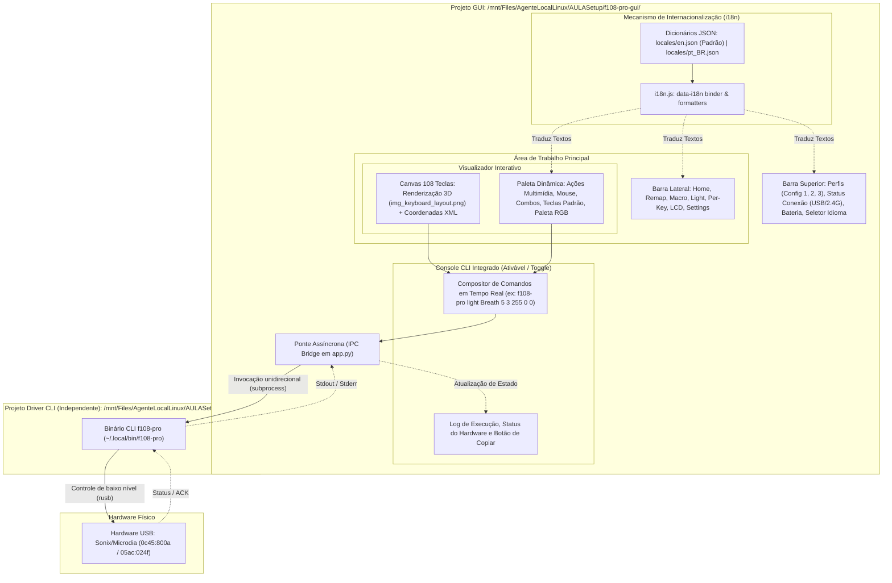

# Planejamento: Interface Gráfica Linux para Teclado Aula F108 Pro (`f108-pro-gui`)

Este documento estabelece o planejamento técnico e arquitetural para o desenvolvimento da interface gráfica (GUI) nativa para Linux do teclado mecânico **AULA F108 Pro**, localizada no diretório dedicado `/mnt/Files/AgenteLocalLinux/AULASetup/f108-pro-gui/`.

---

## 1. Diretrizes e Requisitos Solicitados

1. **Janela de Linha de Comando (CLI Console) Integrada**:
   - Painel de terminal expansível/ocultável (*toggle*) localizado na parte inferior da aplicação.
   - À medida que o usuário interage com os controles visuais (modos de iluminação, paletas de cores, remapeamento de teclas, sincronização do relógio), a GUI **compõe em tempo real o comando CLI equivalente**.
   - Permite visualizar o comando exato, copiar para a área de transferência (*clipboard*), visualizar os logs de saída do binário e executar comandos manualmente.
2. **Planos de Fundo Personalizáveis**:
   - Fundo padrão: Fumaça roxa/magenta oficial da AULA (`home_bkg.png` extraído do software original).
   - Predefinições adicionais: Preto Absoluto (OLED), Gradiente Escuro Moderno, Cyberpunk Neon.
   - Opção para carregar imagem de plano de fundo personalizada do usuário.
3. **Internacionalização Modular (i18n / Localização)**:
   - **Primeiro momento em Inglês**: A interface será construída inicialmente em **Inglês (`en`)**, mantendo a fidelidade com a captura de tela e o software oficial do Windows.
   - **Estrutura aberta para tradução simples**: Criação de um subsistema de internacionalização baseado em dicionários JSON (`ui/locales/en.json`, `ui/locales/pt_BR.json`, etc.).
   - Elementos HTML identificados por atributos declarativos `data-i18n="chave"` e helper JavaScript `i18n.t("chave")`.
   - Adicionar uma nova língua no futuro requer apenas criar um novo arquivo `.json` sem alterar qualquer linha de lógica ou marcação HTML.
   - Seletor de idioma na aba de Configurações com persistência de preferência.
4. **Padrão Rigoroso de Documentação e Comentários**:
   - Cada arquivo e função conterá comentários detalhados explicando sua lógica e papel na aplicação.
   - Documentação dedicada em Markdown (`.md`) para cada subsistema e módulo na pasta `docs/` (incluindo guia de tradução/i18n).
   - Diagrama completo de arquitetura e fluxo de dados do aplicativo.
5. **Orquestração Hierárquica por Subagentes (Economia de Tokens)**:
   - Divisão de trabalho entre subagentes com modelos mais leves (`flash_lite` e `flash`) para tarefas estruturais, redação de documentação, estilos CSS, dicionários i18n e layouts, reservando o modelo principal para o núcleo GTK/WebKit e a ponte assíncrona com o hardware.

---

## 2. Princípio de Desacoplamento e Independência Unidirecional

> [!IMPORTANT]
> **A GUI depende da CLI, mas a CLI NÃO depende da GUI.**

1. **Dependência Unidirecional (`GUI -> CLI`)**:
   - O projeto `f108-pro-gui` atua estritamente como um cliente/frontend visual de alto nível.
   - Todas as operações com o teclado físico (envio de relatórios USB, iluminação, sincronização de relógio, upload de LCD e remapeamento) são delegadas executando o binário `f108-pro` (`~/.local/bin/f108-pro`) ou gerando arquivos YAML padronizados.
   - A GUI nunca acessa o dispositivo USB diretamente com `libusb`, garantindo que não haja concorrência de acesso ou conflitos de drivers.

2. **Independência Total da CLI (`f108-pro` autônomo)**:
   - O projeto do driver em Rust (`f108-pro-rust/`) permanece 100% independente, enxuto e desacoplado.
   - O binário `f108-pro` não possui nenhuma biblioteca gráfica, dependência de GTK, WebKit, Python ou Node.js.
   - Usuários podem usar o teclado exclusivamente via terminal, atalhos de sistema, scripts shell, sem necessidade de carregar a interface gráfica.

3. **Separação Física de Pastas**:
   - `/mnt/Files/AgenteLocalLinux/AULASetup/f108-pro-rust/`: Repositório do driver e binários em Rust (independente).
   - `/mnt/Files/AgenteLocalLinux/AULASetup/f108-pro-gui/`: Repositório dedicado aos programas da GUI, frontend e ativos visuais.

---

## 3. Diagrama Arquitetural do Aplicativo



---

## 4. Matriz de Atribuição de Modelos e Subagentes

| Camada | Modelo | Responsabilidade / Tarefas | Subagente |
|---|---|---|---|
| **Tier 1 (Ativos & Docs)** | `flash_lite` | Extração de dados de `rgb-keyboard.xml` para JSON (`key_coordinates.json`), organização dos ativos (`assets/`), criação dos dicionários de tradução (`locales/en.json`, `locales/pt_BR.json`), redação dos 8 documentos `.md` em `docs/` e `README.md`. | Subagente de documentação, tradução e ativos. |
| **Tier 2 (Frontend & UI)** | `flash` | Implementação do HTML5 estrutural com tags `data-i18n` (`index.html`), motor de internacionalização (`i18n.js`), folhas de estilo CSS responsivas com temas personalizáveis (`styles.css`), renderizador do teclado de 108 teclas (`keyboard.js`), painel CLI expansível e lógica das abas (`remap.js`, `lighting.js`, `lcd.js`). | Subagente de frontend e módulos web. |
| **Tier 3 (Core & IPC)** | Orquestrador Principal | Implementação da janela nativa GTK3/WebKit2 (`app.py`), protocolo de mensagens bidirecional seguro, integração unidirecional com o binário `f108-pro`, testes de ponta a ponta e criação do lançador `.desktop`. | Agente Principal. |

---

## 5. Estrutura de Arquivos em `/mnt/Files/AgenteLocalLinux/AULASetup/f108-pro-gui/`

```text
f108-pro-gui/
├── app.py                      # Ponto de entrada nativo GTK3 + WebKitGTK com IPC bridge
├── f108-pro-gui.desktop        # Lançador para o menu de aplicativos do Linux
├── assets/                     # Recursos visuais originais extraídos do software AULA
│   ├── keyboard/
│   │   ├── img_keyboard_layout.png  # Renderização 3D oficial das 108 teclas
│   │   └── key_coordinates.json    # Coordenadas extraídas do XML (rect_left, rect_top, etc.)
│   ├── icons/                  # Ícones originais de abas, mídia, mouse e status
│   ├── themes/                 # Papéis de parede (home_bkg.png, cyberpunk, oled_black)
│   └── logo/
│       └── app_icon.png        # Ícone do aplicativo para a dock e janela
├── ui/                         # Interface de Usuário (HTML5 / CSS3 / Vanilla JS)
│   ├── index.html              # Estrutura principal da janela com tags data-i18n
│   ├── locales/                # Dicionários de internacionalização modulares
│   │   ├── en.json             # Idioma padrão (Inglês)
│   │   └── pt_BR.json          # Idioma Português do Brasil
│   ├── styles/
│   │   ├── main.css            # Estilos gerais, layout flexbox/grid e responsividade
│   │   ├── themes.css          # Variáveis CSS dos temas de fundo (Fumaça Roxa, OLED, etc.)
│   │   ├── keyboard.css        # Efeitos visuais das 108 teclas (hover, selected, glow RGB)
│   │   └── terminal.css        # Estilos da janela de linha de comando integrada
│   └── js/
│       ├── i18n.js             # Motor de internacionalização (troca dinâmica de idiomas)
│       ├── app.js              # Inicializador da aplicação e roteamento de abas
│       ├── bridge.js           # Comunicação com a ponte nativa Python/WebKit
│       ├── cli_composer.js     # Compositor em tempo real de comandos CLI
│       ├── keyboard_canvas.js  # Renderizador e manipulador de cliques das 108 teclas
│       ├── tab_remap.js        # Lógica de remapeamento (Top Layer, Fn Layer, Mídia, Mouse)
│       ├── tab_lighting.js     # Lógica dos 20 modos RGB, paleta de cores e brilho
│       ├── tab_perkey.js       # Pintura de teclas individuais e presets (WASD, Setas)
│       ├── tab_lcd.js          # Sincronização de relógio e preview de imagem/GIF 240x135
│       └── tab_settings.js     # Troca de plano de fundo, seleção de idioma e configurações
├── docs/                       # Documentação técnica detalhada por subsistema
│   ├── 01_architecture.md      # Arquitetura GTK/WebKit, bridge de mensagens e IPC
│   ├── 02_keyboard_canvas.md   # Mapeamento do layout visual e coordenadas das 108 teclas
│   ├── 03_cli_console.md       # Arquitetura do console integrado e gerador de comandos
│   ├── 04_remap_layers.md      # Protocolo de camadas Top/Fn e tipos de ações
│   ├── 05_rgb_lighting.md      # Controle de efeitos globais e pintura Per-Key
│   ├── 06_tft_lcd.md           # Sincronização de relógio e conversão gráfica para LCD
│   ├── 07_themes_personalization.md # Guia de personalização de temas e imagens de fundo
│   └── 08_i18n_translation_guide.md # Manual para adicionar e customizar novos idiomas
├── tests/
│   ├── test_coordinates.py     # Teste de integridade das coordenadas das 108 teclas
│   ├── test_cli_composer.py    # Teste de geração e equivalência dos comandos da CLI
│   └── test_i18n_locales.py    # Teste de integridade de chaves entre dicionários de idiomas
└── README.md                   # Documentação geral de instalação e execução da GUI
```

---

## 6. Fases de Execução com Delegação Otimizada

### Fase 1: Scaffold, Extração de Ativos, Dicionários i18n e Documentação Base
- [ ] Validar a estrutura da pasta `/mnt/Files/AgenteLocalLinux/AULASetup/f108-pro-gui/`.
- [ ] Extrair as coordenadas de `rgb-keyboard.xml` e gerar `assets/keyboard/key_coordinates.json`.
- [ ] Copiar e organizar os arquivos de imagem originais do Wine (`home_bkg.png`, `img_keyboard_layout.png`, ícones de mídia e mouse) para `assets/`.
- [ ] Criar o dicionário inicial padrão em inglês `ui/locales/en.json` e o suporte a `ui/locales/pt_BR.json`.
- [ ] Gerar os rascunhos de documentação técnica em Markdown (`docs/01_architecture.md` a `docs/03_cli_console.md`).

### Fase 2: Janela Nativa e Ponte de Comunicação (*IPC Bridge*)
- [ ] Implementar `app.py` com `Gtk.Window` e `WebKit2.WebView`.
- [ ] Implementar o manipulador de mensagens assíncrono para executar o binário `~/.local/bin/f108-pro` de forma não bloqueante.
- [ ] Fornecer API segura para invocar subcomandos (`clock`, `light`, `brightness`, `off`, `perkey`, `remap`, `lcd`).

### Fase 3: Frontend, Motor i18n, Teclado Interativo e Compositor CLI
- [ ] Implementar o motor de internacionalização `ui/js/i18n.js` com suporte a `data-i18n` e troca sem recarregar.
- [ ] Implementar `ui/index.html` e a folha de estilos `ui/styles/main.css`.
- [ ] Implementar `ui/js/keyboard_canvas.js`: carregar a imagem 3D e renderizar overlays interativos para cada uma das 108 teclas com suporte a clique e seleção múltipla.
- [ ] Implementar `ui/js/cli_composer.js` e `ui/styles/terminal.css`: o console CLI retrátil no rodapé da janela, atualizando o comando digitado dinamicamente a cada clique/mudança na interface.
- [ ] Implementar `ui/styles/themes.css`: suporte a troca de temas (Fundo Roxo AULA, OLED Dark, Cyberpunk e Imagem Customizada).

### Fase 4: Módulos Funcionais das Abas
- [ ] `ui/js/tab_remap.js`: Gerenciador de camadas (*Top Layer* e *Fn Layer*), modos *Momentary* e *Toggle*, paletas de ações (Standard, Mídia, Mouse, Combos) e geração de perfis YAML.
- [ ] `ui/js/tab_lighting.js`: Seletor dos 20 modos com prévia visual, sliders de brilho e velocidade, seletor de direção e paleta RGB.
- [ ] `ui/js/tab_perkey.js`: Ferramenta de pintura individual de teclas no teclado visual e aplicação via YAML.
- [ ] `ui/js/tab_lcd.js`: Botão de sincronização rápida do relógio, preview 240x135 para imagens/GIFs e chamada para `mkimage` e `f108-pro lcd`.
- [ ] `ui/js/tab_settings.js`: Interface para personalização de planos de fundo, troca dinâmica de idioma e opções gerais.

### Fase 5: Documentação Técnica Completa e Testes
- [ ] Finalizar os documentos em Markdown: `docs/04_remap_layers.md`, `docs/05_rgb_lighting.md`, `docs/06_tft_lcd.md`, `docs/07_themes_personalization.md`, `docs/08_i18n_translation_guide.md` e o `README.md` principal da GUI.
- [ ] Executar os testes de validação das coordenadas, gerador de comandos CLI e integridade dos dicionários i18n.
- [ ] Criar o arquivo `f108-pro-gui.desktop` e instalar o atalho no menu de aplicativos do Linux.
- [ ] Realizar teste completo com o teclado real conectado via USB.
