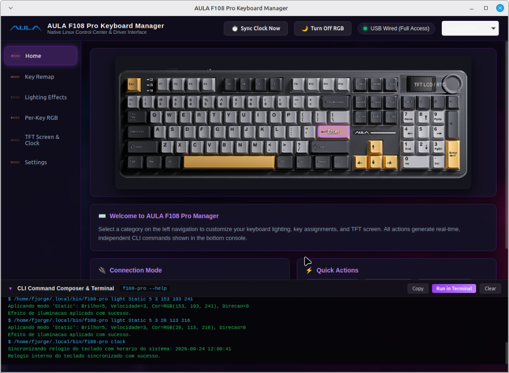

# AULA F108 Pro Keyboard Manager (Linux Native Suite)

[](https://kernel.org)
[](LICENSE)
[](#interoperability)

<p align="center">
  
</p>

> **English** & **Português** documentation below.

---

## English

### Overview
**AULA F108 Pro Keyboard Manager** is a modern, native Linux desktop application and driver suite for the **AULA F108 Pro** three-mode mechanical keyboard (Sonix MCU). It provides a full graphical replacement for the official Windows software without requiring Wine, while maintaining a strictly **decoupled architecture**.

### Key Features
- **104/108-Key Interactive Canvas**: Pixel-accurate 800x300 representation based on official firmware matrices.
- **Collapsible CLI Command Composer**: Displays real-time CLI commands as you interact with the UI, with one-click copy and terminal execution.
- **Physical Key Remapping**: Base and FN layers, standard HID keys, combos, consumer/multimedia, mouse actions, and YAML profile import/export.
- **20 Global Lighting Effects**: Complete control over all 20 hardware modes, brightness (0–5), speed (1–5), and 24-bit RGB colors.
- **Per-Key RGB Painter**: Click-and-drag interactive brush painting on virtual keycaps, with zone presets (WASD Gamer, Numpad, Rainbow).
- **TFT LCD & RTC Clock**: 1-click hardware calendar/clock sync (`0x04 0x28`) and image/GIF upload (240x135 RGB565).
- **Customizable Themes**: Official Purple Smoke (`home_bkg.png`), OLED Pure Black, and Cyberpunk Neon.
- **Extensible i18n Engine**: Dynamic runtime translation (`en`, `pt_BR`) via clean JSON files.

### Decoupled Architecture & Interoperability
```
+-------------------------------------------------------------+
|                  Linux GUI (WebKitGTK 4.1)                  |
|  - Key Matrix Canvas           - Theme Selector             |
|  - Real-Time Command Composer  - i18n Translation Engine    |
+-------------------------------------------------------------+
                              |
               Executes Standard CLI Commands
                              v
+-------------------------------------------------------------+
|         Standalone CLI Driver (`f108-pro`)                  |
|  - Compatible with Rust Driver OR Original Go Driver        |
|  - Zero GUI Dependencies (Headless / Automation ready)      |
+-------------------------------------------------------------+
                              |
                     Direct USB Packets
                              v
+-------------------------------------------------------------+
|               AULA F108 Pro Keyboard (USB)                  |
+-------------------------------------------------------------+
```

You can use this GUI with:
1. **The Native Rust CLI Driver** (`f108-pro-rust`): Fast, strict type safety, deterministic delays.
2. **The Original Go Driver**: The GUI simply executes standard commands (`f108-pro light ...`, `f108-pro clock`, `f108-pro remap ...`). The binary path is configurable in the **Settings** tab.

### Installation & Build

#### Prerequisites (Debian/Ubuntu/Arch/Fedora)
- Python 3.10+
- `gir1.2-webkit2-4.1` (WebKitGTK)
- `python3-gi` (PyGObject)
- `f108-pro` CLI binary installed in `~/.local/bin/f108-pro`

#### Build Standalone Executable:
```bash
./build.sh
```
This generates the standalone binary at `dist/f108-pro-gui/f108-pro-gui` and installs it to `~/.local/bin/f108-pro-gui` with a desktop launcher.

#### Run from Source:
```bash
python3 app.py
```

---

## Português

### Visão Geral
O **AULA F108 Pro Keyboard Manager** é uma aplicação nativa para Linux e suíte de controle para o teclado mecânico tri-modo **AULA F108 Pro**. É uma alternativa moderna e completa ao software oficial de Windows, dispensando o uso do Wine e adotando uma **arquitetura 100% desacoplada**.

### Principais Funcionalidades
- **Canvas Interativo de 104/108 Teclas**: Réplica exata em 800x300 px sobreposta ao modelo 3D oficial.
- **Compositor de Comandos CLI Retrátil**: Exibe o comando CLI exato em tempo real ao clicar nas opções, com botão de cópia rápida e execução no terminal integrado (`Ctrl + \``).
- **Remapeamento de Teclas**: Camadas Base e FN, teclas HID padrão, atalhos com modificadores, funções multimídia, mouse e exportação/importação em YAML.
- **20 Modos de Iluminação Global**: Controle total de todos os modos do firmware, brilho (0 a 5), velocidade (1 a 5) e cores RGB de 24 bits.
- **Pintura RGB Tecla por Tecla**: Pinte o teclado clicando ou arrastando o mouse pelas teclas, com predefinições prontas (WASD Gamer, Numpad, Arco-íris).
- **Visor TFT LCD e Relógio**: Sincronização de relógio de hardware (RTC) em 1 clique e envio de imagens/GIFs personalizados (240x135 RGB565).
- **Temas Personalizáveis**: Fumaça Roxa oficial (`home_bkg.png`), Preto OLED Puro e Cyberpunk Neon.
- **Internacionalização (i18n)**: Suporte a múltiplos idiomas (`en`, `pt_BR`) via arquivos JSON modulares.

### Arquitetura e Interoperabilidade
A interface gráfica **depende do CLI**, mas o **CLI não depende da interface**.
Isso significa que você pode utilizar esta interface com:
- O driver de alta performance em **Rust** (`f108-pro-rust`).
- O driver original em **Go** a partir do qual os dados foram convertidos.

O caminho do binário CLI é detectado automaticamente ou pode ser ajustado diretamente na aba **Settings** da interface.

### Como Compilar e Usar

#### Requisitos do Sistema:
- Python 3.10+
- Bibliotecas GTK 3.0 e WebKitGTK 4.1 (`gir1.2-webkit2-4.1` e `python3-gi`)
- Binário `f108-pro` compilado e acessível no PATH ou em `~/.local/bin/f108-pro`.

#### Compilar Executável Nativo:
```bash
./build.sh
```
O script compila o aplicativo via PyInstaller, gerando a pasta executável `dist/f108-pro-gui/`, cria o atalho no sistema em `~/.local/bin/f108-pro-gui` e adiciona o lançador no menu de aplicativos (`f108-pro-gui.desktop`).

#### Executar Diretamente via Código-Fonte:
```bash
python3 app.py
```

---

## License
MIT License. See [LICENSE](LICENSE) for details.
